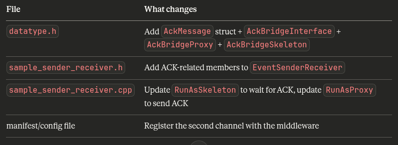

# How to customize the program to exchange custom data

## 1.Include the data type
Include the data type to the existing struct on the datatype.h file or create custom struct in the same file

```
i
```

## How sync messages are received ?

```
Skeleton sends "SYNC"
        ↓
Shared memory buffer (middleware stores it)
        ↓
GetNewSamples() finds it in the buffer
        ↓
Calls the lambda once with a SamplePtr pointing to it
        ↓
lambda calls GetSamplePtrValue(sample.get())
        ↓
Gets a MapApiLanesStamped& where sync_msg = "SYNC"
        ↓
lambda calls receiver.ReceiveSample(sample_value)
        ↓
ReceiveSample() checks: strcmp(sync_msg, "SYNC") == 0  ✓
        ↓
Sets current_phase_ = Phase::Syncing
Increments control_msgs_received_
Returns (no data counted)
        ↓
Back in the loop: real_data_received = 0
cycle does NOT advance
```
----
# Bidirectional communication

## The Core Problem
Right now communication is one-way:
```
Skeleton ──── data ────> Proxy
```
We want:
```
Skeleton ──── data ────> Proxy
Skeleton <─── ACK  ──── Proxy
```
But the current S-CORE setup only has one channel, and it only flows one way — the skeleton sends, the proxy receives. The proxy has no way to send anything back.

## Solution : Two Channels
Create a second independent service that goes in the opposite direction. The proxy becomes a skeleton for this second channel, and the original skeleton becomes a proxy for it.
```
Channel 1:  Original Skeleton ──── data/SYNC ────> Original Proxy
Channel 2:  Original Skeleton <─── ACK       ──── Original Proxy
                                                   (acts as skeleton
                                                    on channel 2)
```
Each process runs both roles at the same time:
```
Process A (sender):         |     Process B (receiver):
  - Skeleton on channel 1   |       - Proxy on channel 1
  - Proxy on channel 2      |       - Skeleton on channel 2
```
**Why this is recommended**: It fits naturally into the S-CORE model.

But we will need to define a second data type and service in datatype.h.

### How Approach 1 Works in Practice

1. Step 1 — Define the ACK data type in `datatype.h`
Add a simple struct just for acknowledgements:
```cpp
struct AckMessage
{
    std::uint32_t ack_for_cycle;  // which cycle are we ACKing?
    char          status[16];     // "ACK", "NACK", etc.
};
```
And define a second interface for it, just like `IpcBridgeInterface` but reversed:
```cpp
template <typename Trait>
class AckBridgeInterface : public Trait::Base
{
  public:
    using Trait::Base::Base;
    typename Trait::template Event<AckMessage> ack_event_{*this, "ack_event"};
};

using AckBridgeProxy    = AsProxy<AckBridgeInterface>;
using AckBridgeSkeleton = AsSkeleton<AckBridgeInterface>;
```
2. Step 2 — The sender process runs both roles
```
Process A (original sender):
  ├── IpcBridgeSkeleton  → sends data on channel 1
  └── AckBridgeProxy     → listens for ACK on channel 2
```
3. Step 3 — The receiver process also runs both roles
```
Process B (original receiver):
  ├── IpcBridgeProxy     → receives data on channel 1
  └── AckBridgeSkeleton  → sends ACK on channel 2
```
4. Step 4 — The new flow
```
Process A                          Process B
─────────                          ─────────
Send data (cycle=0)
                                   Receive data (cycle=0)
                                   Send ACK (ack_for_cycle=0)
Receive ACK (cycle=0)
Send data (cycle=1)
                                   Receive data (cycle=1)
                                   Send ACK (ack_for_cycle=1)
Receive ACK (cycle=1)
...
```
### The Overall Plan
```
Step 1 →  datatype.h          → Add `AckMessage` struct + `AckBridgeInterface` + `AckBridgeProxy` + `AckBridgeSkeleton`
Step 2 →   sample_sender_receiver.h  → add ACK members to the class
Step 3 →   sample_sender_receiver.cpp → RunAsSkeleton waits for ACK
                                      → RunAsProxy sends ACK
Step 4 →   manifest/config file      → register the second channel
```

### What Files we need to Touch and How

