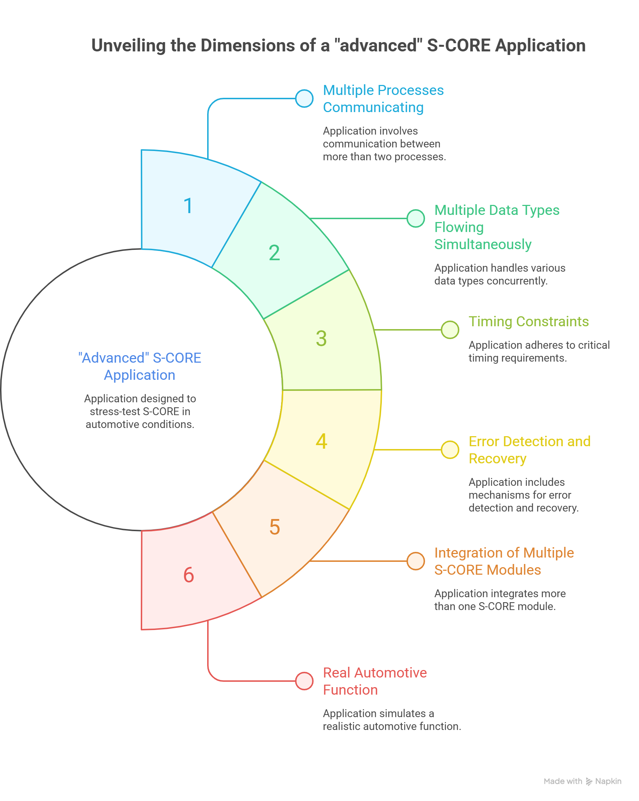
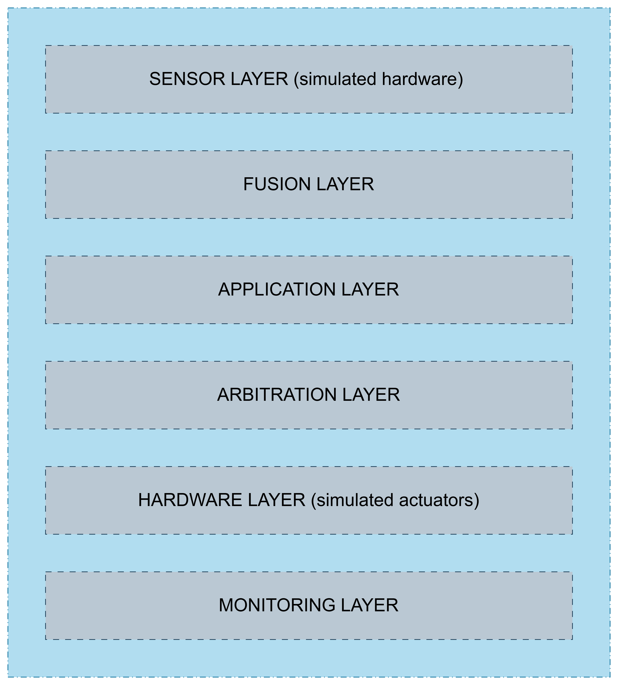

##  1. <a name='Content'></a>Content

<!-- vscode-markdown-toc -->
 1. [Content](#Content)
 2. [Summary](#Summary)
 3. [Motivations](#Motivations)
 4. [Description of the project](#Descriptionoftheproject)
 5. [Requirements](#Requirements)
 6. [The Full System](#TheFullSystem)
 7. [Preview of the project architecutre](#Previewoftheprojectarchitecutre)
 8. [Overview of the project's structure](#Overviewoftheprojectsstructure)
 9. [Layer diagram with modules](#Layerdiagramwithmodules)
 10. [Project File Structure](#ProjectFileStructure)
 11. [The Simulated Scenarios](#TheSimulatedScenarios)
 12. [Implementation Order — Step by Step](#ImplementationOrderStepbyStep)

<!-- vscode-markdown-toc-config
	numbering=true
	autoSave=true
	/vscode-markdown-toc-config -->
<!-- /vscode-markdown-toc -->
---
##  2. <a name='Summary'></a>Summary

This document describes the design of an ADAS Pipeline application
built on Eclipse S-CORE middleware. The application implements
Cruise Control and Automatic Emergency Braking (AEB) across 9
processes organized in 6 layers, integrating the COM, FEO, LOG,
PERSISTENCE and EXEC modules. The goal is to stress-test S-CORE
under realistic automotive conditions and evaluate its readiness
for deployment on embedded hardware such as the NXP S32N7 with QNX.
---

##  3. <a name='Motivations'></a>Motivations
In this project we intend to go beyond the basic exemples and tests of the eclipse s-core and focus more on, but rather see if the Eclipse S-CORE can work as a middleware for a real embedded application, and if it is ready for deployment on hardware (like the NXP S32N7 + QNX). This means our next application shouldn't just be a demo — it should stress-test S-CORE in conditions that resemble real automotive use:
```
✓ Multiple processes communicating (not just 2)
✓ Multiple data types flowing simultaneously
✓ Timing constraints (cycle times that matter)
✓ Error detection and recovery
✓ Integration of more than one S-CORE module
✓ Something that resembles a real automotive function
```


##  4. <a name='Descriptionoftheproject'></a>Description of the project
In this project we want to build an application that includes some ADAS functionalities like Cruise control and Automatic Emergency Braking (AEB), in which we want to use the eclipse s-core platform as a middleware.

##  5. <a name='Requirements'></a>Requirements

```
Functional Requirements:
  FR-1: The system shall simulate vehicle speed from 0 to 120 km/h
  FR-2: Cruise control shall maintain target speed within ±2 km/h
  FR-3: Emergency braking shall activate when obstacle distance < 30m
  FR-4: Brake command shall always override throttle command
  FR-5: System monitor shall detect and log missed ACKs

Non-Functional Requirements:
  NFR-1: Emergency brake process cycle time shall not exceed 10ms
  NFR-2: All inter-process communication shall use Eclipse S-CORE COM
  NFR-3: All events shall be logged with timestamps
  NFR-4: System shall run on Linux (target: portable to QNX)
```

##  6. <a name='TheFullSystem'></a>The Full System
Before the details, here is the complete picture in one diagram:
##  7. <a name='Previewoftheprojectarchitecutre'></a>Preview of the project architecutre
```
                    ┌─────────────────┐
                    │   SENSOR LAYER  │
          ┌─────────┤                 ├─────────┐
          │         └─────────────────┘         │
          ▼                                     ▼
  Process 1: Speed Sensor          Process 2: Distance Sensor
  (simulated vehicle speed)        (simulated obstacle distance)
          │                                     │
          └──────────────┬──────────────────────┘
                         │ COM (both feed into fusion)
                         ▼
                ┌─────────────────┐
                │  FUSION LAYER   │
                │                 │
                │ Process 3:      │
                │ Sensor Fusion   │
                │ combines speed  │
                │ + distance into │
                │ one VehicleState│
                └────────┬────────┘
                         │ COM
              ┌──────────┴──────────┐
              │                     │
              ▼                     ▼
    ┌──────────────────┐  ┌──────────────────────┐
    │  APP LAYER       │  │  APP LAYER           │
    │                  │  │                      │
    │ Process 4:       │  │ Process 5:           │
    │ Cruise Control   │  │ Emergency Braking    │
    │ FEO: 50ms cycle  │  │ FEO: 10ms cycle      │
    │ PID algorithm    │  │ threshold algorithm  │
    └────────┬─────────┘  └──────────┬───────────┘
             │ COM                   │ COM
             └──────────┬────────────┘
                        ▼
             ┌──────────────────────┐
             │   ARBITRATION LAYER  │
             │                      │
             │ Process 6:           │
             │ Command Arbitrator   │
             │ "brake always wins"  │
             │ resolves conflicts   │
             └──────────┬───────────┘
                        │ COM
              ┌─────────┴──────────┐
              │                    │
              ▼                    ▼
    ┌──────────────────┐  ┌──────────────────┐
    │  HARDWARE LAYER  │  │  HARDWARE LAYER  │
    │                  │  │                  │
    │ Process 7:       │  │ Process 8:       │
    │ Throttle         │  │ Brake            │
    │ Actuator         │  │ Actuator         │
    │ simulates engine │  │ simulates brakes │
    │ response         │  │ response         │
    └──────────────────┘  └──────────────────┘
              │                    │
              └─────────┬──────────┘
                        ▼
             ┌──────────────────────┐
             │   MONITORING LAYER   │
             │                      │
             │ Process 9:           │
             │ System Monitor       │
             │ LOG module           │
             │ Persistence module   │
             │ records everything   │
             │ detects anomalies    │
             └──────────────────────┘
```
The layered architecture was deliberately chosen to reflect
real automotive software stacks. As a result:

    "We structured the application to mirror the real AUTOSAR Adaptive layered architecture, so the S-CORE COM channels correspond to the inter-ECU communication paths we would use on the NXP S32N7."

```
Sensor Layer     → Hardware Abstraction Layer (HAL)
Fusion Layer     → Sensor fusion ECU
Application Layer→  ADAS functions (cruise, AEB)
Arbitration Layer→  Safety arbitration / supervisory controller
Hardware Layer   →  Actuator ECUs (throttle, brake ECUs)
Monitoring Layer →  Diagnostic and logging ECU
```
##  8. <a name='Overviewoftheprojectsstructure'></a>Overview of the project's structure


```
━━━━━━━━━━━━━━━━━━━━━━━━━━━━━━━━━━━━━━━━━━━━━━━━━━━━━━━━━━━━
                     ADAS PIPELINE SYSTEM
━━━━━━━━━━━━━━━━━━━━━━━━━━━━━━━━━━━━━━━━━━━━━━━━━━━━━━━━━━━━

SENSOR LAYER (simulated hardware)
─────────────────────────────────
Process 1: speed_sensor
  Simulates vehicle speed (0 → 120 km/h, realistic ramp)
  Skeleton on: score/SpeedSensor
  FEO cycle:   20ms

Process 2: distance_sensor
  Simulates obstacle distance (100m → 2m, obstacle approaching)
  Skeleton on: score/DistanceSensor
  FEO cycle:   20ms

        │ SpeedData               │ DistanceData
        ▼                         ▼

FUSION LAYER
────────────
Process 3: sensor_fusion
  Proxy on:    score/SpeedSensor + score/DistanceSensor
  Combines both into one VehicleState struct
  Skeleton on: score/VehicleState
  FEO cycle:   20ms (runs after both sensors)

        │ VehicleState (speed + distance + timestamp)
        ├─────────────────────┐
        ▼                     ▼

APPLICATION LAYER
─────────────────
Process 4: cruise_control        Process 5: emergency_brake
  Proxy on: score/VehicleState     Proxy on: score/VehicleState
  PID algorithm:                   Threshold algorithm:
    if speed < target → throttle     if distance < 30m → brake
    if speed > target → release      force = f(distance, speed)
  Skeleton on: score/CruiseCmd    Skeleton on: score/BrakeCmd
  FEO cycle: 50ms                 FEO cycle: 10ms (safety critical)

        │ CruiseCommand            │ BrakeCommand
        ▼                          ▼

ARBITRATION LAYER
─────────────────
Process 6: command_arbitrator
  Proxy on:    score/CruiseCmd + score/BrakeCmd
  Rule:        brake ALWAYS overrides throttle
  Rule:        if brake active → send throttle = 0
  Skeleton on: score/ThrottleCmd + score/BrakeActuatorCmd
  FEO cycle:   10ms

        │ ThrottleCommand          │ BrakeActuatorCommand
        ▼                          ▼

HARDWARE LAYER (simulated actuators)
─────────────────────────────────────
Process 7: throttle_actuator     Process 8: brake_actuator
  Proxy on: score/ThrottleCmd      Proxy on: score/BrakeActuatorCmd
  Simulates engine response:       Simulates brake response:
    speed += throttle * dt           deceleration = brake_force/mass
  Sends ACK back                   Sends ACK back
  LOG: all state changes           LOG: all state changes

        │ ACK                       │ ACK
        ▼                           ▼

MONITORING LAYER
────────────────
Process 9: system_monitor
  Proxy on:    ALL ACK channels
  LOG module:  structured log of every event
  Persistence: writes CSV log to disk every second
  Detects:     missed ACKs, timing violations, unsafe states
━━━━━━━━━━━━━━━━━━━━━━━━━━━━━━━━━━━━━━━━━━━━━━━━━━━━━━━━━━━━
```
---

##  9. <a name='Layerdiagramwithmodules'></a>Layer diagram with modules

In the following diagram we have the different layers of our system, and most importantly each s-core module that might be used in this each layer :
```
━━━━━━━━━━━━━━━━━━━━━━━━━━━━━━━━━━━━━━━━━━━━━━━━━━━━━━━━━━━━━━━━━━━━━
                        ADAS PIPELINE SYSTEM
                   Layer Architecture + S-CORE Modules
━━━━━━━━━━━━━━━━━━━━━━━━━━━━━━━━━━━━━━━━━━━━━━━━━━━━━━━━━━━━━━━━━━━━━

┌─────────────────────────────────────────────────────────────────────┐
│  SENSOR LAYER                                                       │
│  Process 1: speed_sensor        Process 2: distance_sensor         │
│                                                                     │
│  ┌──────────────────────┐       ┌──────────────────────────┐       │
│  │ Simulated speed data │       │ Simulated distance data  │       │
│  │ 0 → 120 km/h ramp    │       │ 100m → 2m approach       │       │
│  └──────────────────────┘       └──────────────────────────┘       │
│                                                                     │
│  S-CORE modules used:                                               │
│  ┌─────────┐  ┌─────────┐  ┌──────────┐                           │
│  │   COM   │  │   FEO   │  │   LOG    │                           │
│  │skeleton │  │ 20ms    │  │ sensor   │                           │
│  │ sends   │  │ period  │  │ readings │                           │
│  └─────────┘  └─────────┘  └──────────┘                           │
└────────────────────────────┬────────────────────────────────────────┘
                             │ SpeedData + DistanceData (COM)
                             ▼
┌─────────────────────────────────────────────────────────────────────┐
│  FUSION LAYER                                                       │
│  Process 3: sensor_fusion                                           │
│                                                                     │
│  ┌──────────────────────────────────────────────────────────────┐  │
│  │  Receives SpeedData + DistanceData                           │  │
│  │  Combines into one VehicleState struct                       │  │
│  │  Computes: obstacle_detected, closing_speed, status tag      │  │
│  └──────────────────────────────────────────────────────────────┘  │
│                                                                     │
│  S-CORE modules used:                                               │
│  ┌─────────┐  ┌─────────┐  ┌──────────┐                           │
│  │   COM   │  │   FEO   │  │   LOG    │                           │
│  │proxy +  │  │ runs    │  │ logs     │                           │
│  │skeleton │  │ AFTER   │  │ fusion   │                           │
│  │         │  │ sensors │  │ output   │                           │
│  └─────────┘  └─────────┘  └──────────┘                           │
└────────────────────────────┬────────────────────────────────────────┘
                             │ VehicleState (COM)
                    ┌────────┴────────┐
                    ▼                 ▼
┌───────────────────────┐   ┌─────────────────────────────────────────┐
│  APPLICATION LAYER    │   │  APPLICATION LAYER                      │
│  Process 4:           │   │  Process 5:                             │
│  cruise_control       │   │  emergency_brake                        │
│                       │   │                                         │
│  ┌─────────────────┐  │   │  ┌───────────────────────────────────┐ │
│  │  PID Controller │  │   │  │  Threshold Algorithm              │ │
│  │  Kp=0.8         │  │   │  │  >50m  → 0% brake                │ │
│  │  Ki=0.1         │  │   │  │  >30m  → 20% brake               │ │
│  │  Kd=0.05        │  │   │  │  >10m  → 60% brake               │ │
│  │  target: 80km/h │  │   │  │  <=10m → 100% EMERGENCY          │ │
│  └─────────────────┘  │   │  └───────────────────────────────────┘ │
│                       │   │                                         │
│  S-CORE modules:      │   │  S-CORE modules:                        │
│  ┌──────┐ ┌────────┐  │   │  ┌──────┐ ┌────────┐ ┌─────────────┐  │
│  │ COM  │ │  FEO   │  │   │  │ COM  │ │  FEO   │ │     LOG     │  │
│  │proxy+│ │ 50ms   │  │   │  │proxy+│ │ 10ms   │ │ every brake │  │
│  │skel  │ │ period │  │   │  │skel  │ │ period │ │ event       │  │
│  └──────┘ └────────┘  │   │  └──────┘ └────────┘ └─────────────┘  │
└───────────┬───────────┘   └──────────────────┬──────────────────────┘
            │ CruiseCommand (COM)               │ BrakeCommand (COM)
            └──────────────┬────────────────────┘
                           ▼
┌─────────────────────────────────────────────────────────────────────┐
│  ARBITRATION LAYER                                                  │
│  Process 6: command_arbitrator                                      │
│                                                                     │
│  ┌──────────────────────────────────────────────────────────────┐  │
│  │  Rule 1: if brake_force > 0  →  throttle = 0                │  │
│  │  Rule 2: if emergency = true →  throttle = 0, brake = 100%  │  │
│  │  Rule 3: if no brake cmd     →  pass throttle through        │  │
│  │  Rule 4: log every override  →  audit trail                  │  │
│  └──────────────────────────────────────────────────────────────┘  │
│                                                                     │
│  S-CORE modules used:                                               │
│  ┌─────────┐  ┌─────────┐  ┌──────────┐                           │
│  │   COM   │  │   FEO   │  │   LOG    │                           │
│  │proxy +  │  │ 10ms    │  │ every    │                           │
│  │skeleton │  │ AFTER   │  │ override │                           │
│  │         │  │ app     │  │ logged   │                           │
│  └─────────┘  └─────────┘  └──────────┘                           │
└──────────────┬──────────────────────────┬───────────────────────────┘
               │ ThrottleCommand (COM)    │ BrakeActuatorCommand (COM)
               ▼                          ▼
┌──────────────────────────┐  ┌──────────────────────────────────────┐
│  HARDWARE LAYER          │  │  HARDWARE LAYER                      │
│  Process 7:              │  │  Process 8:                          │
│  throttle_actuator       │  │  brake_actuator                      │
│                          │  │                                      │
│  ┌─────────────────────┐ │  │  ┌──────────────────────────────┐   │
│  │ Simulates engine:   │ │  │  │ Simulates braking:           │   │
│  │ speed += throttle   │ │  │  │ decel = force / mass         │   │
│  │         * dt        │ │  │  │ speed -= decel * dt          │   │
│  │ max accel: 3 m/s²   │ │  │  │ max decel: 8 m/s²            │   │
│  └─────────────────────┘ │  │  └──────────────────────────────┘   │
│                          │  │                                      │
│  S-CORE modules:         │  │  S-CORE modules:                     │
│  ┌──────┐ ┌───────────┐  │  │  ┌──────┐ ┌──────┐ ┌────────────┐  │
│  │ COM  │ │    LOG    │  │  │  │ COM  │ │ LOG  │ │PERSISTENCE │  │
│  │proxy │ │state each │  │  │  │proxy │ │every │ │CSV log     │  │
│  │+ ACK │ │cycle      │  │  │  │+ ACK │ │stop  │ │to disk     │  │
│  │skel  │ │           │  │  │  │skel  │ │event │ │            │  │
│  └──────┘ └───────────┘  │  │  └──────┘ └──────┘ └────────────┘  │
└──────────────────────────┘  └──────────────────────────────────────┘
               │ ThrottleAck (COM)        │ BrakeAck (COM)
               └──────────────┬───────────┘
                              ▼
┌─────────────────────────────────────────────────────────────────────┐
│  MONITORING LAYER                                                   │
│  Process 9: system_monitor                                          │
│                                                                     │
│  ┌──────────────────────────────────────────────────────────────┐  │
│  │  Receives all ACKs from hardware layer                       │  │
│  │  Detects: missed ACKs, timing violations, unsafe states      │  │
│  │  Writes: structured log + CSV to disk every second           │  │
│  │  Alerts: if emergency brake fires more than 3x in 10s        │  │
│  └──────────────────────────────────────────────────────────────┘  │
│                                                                     │
│  S-CORE modules used:                                               │
│  ┌─────────┐  ┌──────────┐  ┌─────────────┐  ┌────────────────┐  │
│  │   COM   │  │   LOG    │  │ PERSISTENCE │  │      EXEC      │  │
│  │  proxy  │  │structured│  │  CSV file   │  │monitors process│  │
│  │receives │  │log every │  │  written    │  │health, detects │  │
│  │all ACKs │  │event     │  │  each sec   │  │crashes         │  │
│  └─────────┘  └──────────┘  └─────────────┘  └────────────────┘  │
└─────────────────────────────────────────────────────────────────────┘

━━━━━━━━━━━━━━━━━━━━━━━━━━━━━━━━━━━━━━━━━━━━━━━━━━━━━━━━━━━━━━━━━━━━━
MODULE SUMMARY
━━━━━━━━━━━━━━━━━━━━━━━━━━━━━━━━━━━━━━━━━━━━━━━━━━━━━━━━━━━━━━━━━━━━━
COM         → every process (data exchange between all layers)
FEO         → sensor, fusion, app, arbitration (timing control)
LOG         → fusion, app, arbitration, hardware (event recording)
PERSISTENCE → brake_actuator, monitor (disk storage)
EXEC        → monitor only (process health supervision)
━━━━━━━━━━━━━━━━━━━━━━━━━━━━━━━━━━━━━━━━━━━━━━━━━━━━━━━━━━━━━━━━━━━━━
```

##  10. <a name='ProjectFileStructure'></a>Project File Structure
```
adas_pipeline/
├── src/
│   ├── datatype.h                    ← all structs + interfaces
│   ├── processes/
│   │   ├── speed_sensor.cpp
│   │   ├── distance_sensor.cpp
│   │   ├── sensor_fusion.cpp
│   │   ├── cruise_control.cpp
│   │   ├── emergency_brake.cpp
│   │   ├── command_arbitrator.cpp
│   │   ├── throttle_actuator.cpp
│   │   ├── brake_actuator.cpp
│   │   └── system_monitor.cpp
│   ├── algorithms/
│   │   ├── pid_controller.h          ← reusable PID class
│   │   └── pid_controller.cpp
│   └── etc/
│       └── mw_com_config.json
├── BUILD
└── src/BUILD
```

Each process gets its own `.cpp` file with its own `main()` — they compile into separate executables, just like real separate ECU software.

##  11. <a name='TheSimulatedScenarios'></a>The Simulated Scenarios

The sensor process will cycle through three realistic scenarios automatically:
```
Scenario 1 — Normal cruise (0s to 10s):
  speed:    ramps from 0 to 80 km/h smoothly
  distance: stays at 100m (no obstacle)
  expected: cruise control maintains 80 km/h, no braking

Scenario 2 — Obstacle approaching (10s to 20s):
  speed:    holds at 80 km/h
  distance: decreases from 100m to 25m (obstacle ahead)
  expected: cruise control reduces throttle, brake system activates at 30m

Scenario 3 — Emergency (20s to 25s):
  speed:    still 80 km/h
  distance: drops from 25m to 5m rapidly
  expected: emergency brake fires, throttle cut to 0, full brake applied
```
---
