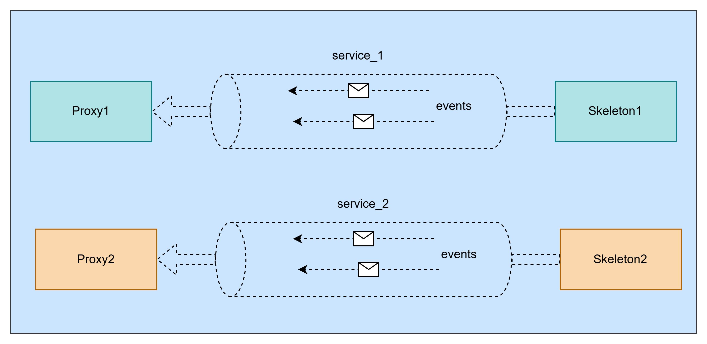

# How to customize the program to exchange custom data

## The Core Concepts First

### The Full Project Structure
```
score_scrample/
│
├── src/                          ← all your source code lives here
│   ├── main.cpp                  ← entry point, CLI parsing, runtime init
│   ├── sample_sender_receiver.h  ← class blueprint
│   ├── sample_sender_receiver.cpp← actual logic (skeleton + proxy)
│   ├── datatype.h                ← data structs + service interfaces
│   ├── assert_handler.h          ← error/crash handling setup
│   └── etc/
│       └── mw_com_config.json    ← middleware configuration
│
├── BUILD                         ← top-level Bazel build file
├── src/BUILD                     ← source-level Bazel build rules
├── WORKSPACE or MODULE.bazel     ← external dependencies declaration
└── .bazelrc                      ← build flags and configurations
```
### How the Files Connect to Each Other
```
main.cpp
  │
  ├── #include "sample_sender_receiver.h"
  │       │
  │       ├── #include "datatype.h"
  │       │       └── defines: MapApiLanesStamped, AckMessage,
  │       │                    IpcBridgeProxy, IpcBridgeSkeleton,
  │       │                    AckBridgeProxy, AckBridgeSkeleton
  │       │
  │       └── declares: EventSenderReceiver class
  │
  └── uses: score::mw::com::runtime::InitializeRuntime()
            score::mw::com::InstanceSpecifier::Create()
            EventSenderReceiver::RunAsSkeleton()
            EventSenderReceiver::RunAsProxy()

sample_sender_receiver.cpp
  │
  ├── #include "sample_sender_receiver.h"  ← implements the class
  └── uses all types from datatype.h
      connects to config via InstanceSpecifier strings

mw_com_config.json
  └── loaded at runtime by InitializeRuntime()
      must match all strings and IDs used in the code
```
---

Before the rules and adding changes, we need to understand what a service and an event actually are in S-CORE:
```
Service = a communication channel between two processes
          (like a phone line between two people)

Event   = a named data stream WITHIN a service
          (like different topics you can talk about on that phone line)
```
So the relationship is:
```
One Service
├── Event A  (e.g. map_api_lanes_stamped)
├── Event B  (e.g. speed_data)
└── Event C  (e.g. status_info)
```
### When Do we Define a New Service?
We need a new service (new entry in `mw_com_config.json` + new Interface template in `datatype.h`) when:

* **Rule 1 — Direction changes**
This is the most important rule. A service is strictly one-directional — one skeleton sends, proxies receive. You cannot reverse direction on the same service.

```
This is why we needed a second service for ACK:

Service 1: Process A (skeleton) ──→ Process B (proxy)   [data]
Service 2: Process A (proxy)    ←── Process B (skeleton) [ACK]
```
* **Rule 2 — Different processes own the channel**

If a completely different pair of processes needs to communicate, they need their own service — you can't share another pair's service.


* **Rule 3 — Different ASIL levels**

Safety-critical data must travel on its own service with its own ASIL credentials. We can't mix QM and ASIL-D data on the same service.

### When Do we Define a New Event?

You need a new event (new line in the Interface template) when you want to send additional data types in the same direction between the same two processes.

```cpp
template <typename Trait>
class MyInterface : public Trait::Base
{
  public:
    using Trait::Base::Base;

    // These are TWO events on ONE service:
    typename Trait::template Event<LaneData>   lane_event_{*this, "lane_event"};
    typename Trait::template Event<SpeedData>  speed_event_{*this, "speed_event"};
};
```
Both events flow from the **same skeleton to the same proxy**, just carrying different data types.

## 1.Include the data type
Include the data type to the existing struct on the datatype.h file or create custom struct in the same file

```
i
```

## How sync messages are received ?

```
Skeleton sends "SYNC"
        ↓
Shared memory buffer (middleware stores it)
        ↓
GetNewSamples() finds it in the buffer
        ↓
Calls the lambda once with a SamplePtr pointing to it
        ↓
lambda calls GetSamplePtrValue(sample.get())
        ↓
Gets a MapApiLanesStamped& where sync_msg = "SYNC"
        ↓
lambda calls receiver.ReceiveSample(sample_value)
        ↓
ReceiveSample() checks: strcmp(sync_msg, "SYNC") == 0  ✓
        ↓
Sets current_phase_ = Phase::Syncing
Increments control_msgs_received_
Returns (no data counted)
        ↓
Back in the loop: real_data_received = 0
cycle does NOT advance
```
----
# Bidirectional communication

## The Core Problem
Right now communication is one-way:
```
Skeleton ──── data ────> Proxy
```
We want:
```
Skeleton ──── data ────> Proxy
Skeleton <─── ACK  ──── Proxy
```
But the current S-CORE setup only has one channel, and it only flows one way — the skeleton sends, the proxy receives. The proxy has no way to send anything back.

## Solution : Two Channels
Create a second independent service that goes in the opposite direction. The proxy becomes a skeleton for this second channel, and the original skeleton becomes a proxy for it.
```
Channel 1:  Original Skeleton ──── data/SYNC ────> Original Proxy
Channel 2:  Original Skeleton <─── ACK       ──── Original Proxy
                                                   (acts as skeleton
                                                    on channel 2)
```
Each process runs both roles at the same time:
```
Process A (sender):         |     Process B (receiver):
  - Skeleton on channel 1   |       - Proxy on channel 1
  - Proxy on channel 2      |       - Skeleton on channel 2
```
**Why this is recommended**: It fits naturally into the S-CORE model.

But we will need to define a second data type and service in datatype.h.

### How Approach 1 Works in Practice

1. Step 1 — Define the ACK data type in `datatype.h`
Add a simple struct just for acknowledgements:
```cpp
struct AckMessage
{
    std::uint32_t ack_for_cycle;  // which cycle are we ACKing?
    char          status[16];     // "ACK", "NACK", etc.
};
```
And define a second interface for it, just like `IpcBridgeInterface` but reversed:
```cpp
template <typename Trait>
class AckBridgeInterface : public Trait::Base
{
  public:
    using Trait::Base::Base;
    typename Trait::template Event<AckMessage> ack_event_{*this, "ack_event"};
};

using AckBridgeProxy    = AsProxy<AckBridgeInterface>;
using AckBridgeSkeleton = AsSkeleton<AckBridgeInterface>;
```
2. Step 2 — The sender process runs both roles
```
Process A (original sender):
  ├── IpcBridgeSkeleton  → sends data on channel 1
  └── AckBridgeProxy     → listens for ACK on channel 2
```
3. Step 3 — The receiver process also runs both roles
```
Process B (original receiver):
  ├── IpcBridgeProxy     → receives data on channel 1
  └── AckBridgeSkeleton  → sends ACK on channel 2
```
4. Step 4 — The new flow
```
Process A                          Process B
─────────                          ─────────
Send data (cycle=0)
                                   Receive data (cycle=0)
                                   Send ACK (ack_for_cycle=0)
Receive ACK (cycle=0)
Send data (cycle=1)
                                   Receive data (cycle=1)
                                   Send ACK (ack_for_cycle=1)
Receive ACK (cycle=1)
...
```
### The Overall Plan
```
Step 1 →  datatype.h          → Add `AckMessage` struct + `AckBridgeInterface` + `AckBridgeProxy` + `AckBridgeSkeleton`
Step 2 →   sample_sender_receiver.h  → add ACK members to the class
Step 3 →   sample_sender_receiver.cpp → RunAsSkeleton waits for ACK
                                      → RunAsProxy sends ACK
Step 4 →   manifest/config file      → register the second channel
```

### What Files we need to Touch and How


1. **Add Ack-related memebers to 'EventSenderReceiver' class**

This file is the blueprint of the EventSenderReceiver class. Right now it only knows about the data channel. We need to tell it that it also manages the ACK channel.
Here is what the class looks like now conceptually:
```
EventSenderReceiver
├── RunAsSkeleton()   → sends data
├── RunAsProxy()      → receives data
├── event_sending_mutex_
├── event_published_
├── map_lanes_mutex_
└── map_lanes_list_
```
We need to add two new private members — one to hold received ACKs, and one to signal between threads when an ACK arrives:

```cpp
#ifndef SCORE_MW_COM_IPC_BRIDGE_SAMPLE_SENDER_RECEIVER_H
#define SCORE_MW_COM_IPC_BRIDGE_SAMPLE_SENDER_RECEIVER_H

#include "datatype.h"
#include <score/optional.hpp>
#include <atomic>
#include <chrono>
#include <mutex>
#include <random>
#include <vector>
#include <condition_variable>    // NEW: needed to wake skeleton when ACK arrives

namespace score::mw::com
{

class EventSenderReceiver
{
  public:
    int RunAsSkeleton(const score::mw::com::InstanceSpecifier& instance_specifier,
                      const std::chrono::milliseconds cycle_time,
                      const std::size_t num_cycles);

    template <typename ProxyType = score::mw::com::IpcBridgeProxy,
              typename ProxyEventType = score::mw::com::impl::ProxyEvent<MapApiLanesStamped>>
    int RunAsProxy(const score::mw::com::InstanceSpecifier& instance_specifier,
                   const score::cpp::optional<std::chrono::milliseconds> cycle_time,
                   const std::size_t num_cycles,
                   bool try_writing_to_data_segment = false,
                   bool check_sample_hash = true);

  private:
    // ── Existing members (data channel) ─────────────────────────────────────
    std::mutex event_sending_mutex_{};
    std::atomic<bool> event_published_{false};
    std::mutex map_lanes_mutex_{};
    std::vector<SamplePtr<MapApiLanesStamped>> map_lanes_list_{};

    // ── NEW: ACK channel members ─────────────────────────────────────────────

    // Stores the cycle number of the last ACK received from the proxy.
    // optional means "no ACK received yet" when empty.
    score::cpp::optional<std::uint32_t> last_ack_cycle_{};

    // Mutex protecting last_ack_cycle_ (two threads may touch it:
    // the ACK-listening thread writes it, RunAsSkeleton reads it).
    std::mutex ack_mutex_{};

    // Condition variable: lets RunAsSkeleton SLEEP until an ACK arrives,
    // instead of spinning in a busy loop checking last_ack_cycle_ constantly.
    std::condition_variable ack_received_cv_{};
};

}  // namespace score::mw::com

#endif
```
***Difference between using conditional_variables and not using them***

Without it, the skeleton would have to do this to wait for an ACK:
```cpp
// BAD — busy loop, wastes CPU
while (!last_ack_cycle_.has_value()) { /* keep checking */ }
```
With `condition_variable`, the skeleton thread goes to sleep and the OS wakes it up the moment an ACK arrives — zero CPU wasted:
```cpp
// GOOD — sleep until notified
std::unique_lock lock{ack_mutex_};
ack_received_cv_.wait(lock, [&]{ return last_ack_cycle_.has_value(); });
```
2. Update the sample_sender_receiver.cpp for `RunAsSkeleton` to wait for ACK, and for `RunAsProxy` to send ACK

The skeleton currently does this:
```
send data → sleep → send data → sleep → ...
```
We want:
```
send data → wait for ACK → send data → wait for ACK → ...
```

Here is the updated loop inside `RunAsSkeleton`, with the ACK-waiting logic added. Only the data-sending loop changes — SYNC/SYNC_ACK/END phases stay the same:

```cpp
// ── PHASE 3: Send actual data, wait for ACK after each ──────────────────
std::cout << "Starting to send data\n";
for (std::size_t cycle = 0U; cycle < num_cycles || num_cycles == 0U; ++cycle)
{
    // ── Send one data sample ─────────────────────────────────────────────
    auto sample_result = PrepareMapLaneSample(skeleton, cycle, "");
    if (!sample_result.has_value())
    {
        std::cerr << "Sample allocation failed. Exiting.\n";
        return EXIT_FAILURE;
    }
    {
        std::lock_guard lock{event_sending_mutex_};
        skeleton.map_api_lanes_stamped_.Send(std::move(sample_result).value());
        event_published_ = true;
    }
    std::cout << "Sent cycle " << cycle << ", waiting for ACK...\n";

    // ── Wait for ACK from the proxy ──────────────────────────────────────
    // We sleep here until the ACK-listening thread wakes us up.
    // The timeout (5 seconds) prevents waiting forever if proxy crashes.
    {
        std::unique_lock lock{ack_mutex_};

        const bool ack_arrived = ack_received_cv_.wait_for(
            lock,
            std::chrono::seconds(5),          // timeout: give up after 5s
            [this, cycle] {
                // Wake up condition: last_ack_cycle_ must match current cycle
                return last_ack_cycle_.has_value() &&
                       last_ack_cycle_.value() == static_cast<std::uint32_t>(cycle);
            });

        if (!ack_arrived)
        {
            std::cerr << "Timeout: no ACK received for cycle " << cycle << ", terminating.\n";
            return EXIT_FAILURE;
        }

        std::cout << "ACK received for cycle " << cycle << ", proceeding.\n";
    }

    // Only sleep between cycles if desired — now we're ACK-gated not time-gated
    std::this_thread::sleep_for(cycle_time);
}
```
Part B — RunAsProxy: send ACK after receiving data, and run the ACK skeleton in a background thread

This is the most important architectural point. The proxy needs to do two things at the same time:

    -Keep receiving data on channel 1 (existing loop)
    -Send ACKs on channel 2 (new)
The cleanest way to do this at your level is to run the ACK skeleton in a separate thread that the proxy starts before its main loop. The thread just listens for a signal, then sends an ACK.

Here's how you add this to `RunAsProxy`, right before the main receive loop:

```cpp
// ── Start the ACK skeleton in a background thread ────────────────────────
// This thread runs alongside the main receive loop.
// When the main loop receives a data sample, it signals this thread
// to send an ACK back to the skeleton.

// These variables are shared between the main loop and the ACK thread:
std::mutex           ack_send_mutex{};
std::condition_variable ack_send_cv{};
std::uint32_t        cycle_to_ack{0U};
bool                 ack_requested{false};
bool                 ack_thread_should_stop{false};

// The ACK-sending thread:
std::thread ack_thread([&]()
{
    // Create the ACK skeleton (proxy sends ACK, so it needs a skeleton here)
    const auto ack_instance_result =
        score::mw::com::InstanceSpecifier::Create("score/AckMessage");
    if (!ack_instance_result.has_value())
    {
        std::cerr << "ACK: invalid instance specifier\n";
        return;
    }

    auto ack_skeleton_result = AckBridgeSkeleton::Create(ack_instance_result.value());
    if (!ack_skeleton_result.has_value())
    {
        std::cerr << "ACK: could not create skeleton: " << ack_skeleton_result.error() << "\n";
        return;
    }
    auto& ack_skeleton = ack_skeleton_result.value();
    ack_skeleton.OfferService();

    // Loop: wait for a signal, then send ACK
    while (true)
    {
        std::uint32_t cycle_num{0U};
        {
            std::unique_lock lock{ack_send_mutex};
            // Sleep until main loop signals us or tells us to stop
            ack_send_cv.wait(lock, [&]{
                return ack_requested || ack_thread_should_stop;
            });

            if (ack_thread_should_stop) { break; }

            cycle_num = cycle_to_ack;
            ack_requested = false;   // reset for next cycle
        }

        // Build and send the ACK sample
        auto ack_sample_result = ack_skeleton.ack_event_.Allocate();
        if (!ack_sample_result.has_value()) { continue; }

        auto ack_sample = std::move(ack_sample_result).value();
        ack_sample->ack_for_cycle = cycle_num;
        std::strncpy(ack_sample->status, "ACK", 15);
        ack_sample->status[15] = '\0';

        ack_skeleton.ack_event_.Send(std::move(ack_sample));
        std::cout << "Sent ACK for cycle " << cycle_num << "\n";
    }

    ack_skeleton.StopOfferService();
});
```
Then in the main receive loop, after a real data sample is received, signal the ACK thread:

```cpp
const auto real_data_received = receiver.GetReceivedSampleCount() - received_before;
if (real_data_received >= 1U)
{
    std::cout << ToString(instance_specifier, ": Proxy received valid data\n");

    // Signal the ACK thread to send ACK for this cycle
    {
        std::lock_guard lock{ack_send_mutex};
        cycle_to_ack  = static_cast<std::uint32_t>(cycle);
        ack_requested = true;
    }
    ack_send_cv.notify_one();   // wake up the ACK thread

    cycle += real_data_received;
}
```

And at the very end of RunAsProxy, before returning, stop the thread cleanly:

```cpp
// Tell the ACK thread to stop and wait for it to finish
{
    std::lock_guard lock{ack_send_mutex};
    ack_thread_should_stop = true;
}
ack_send_cv.notify_one();
ack_thread.join();   // wait until thread has fully exited
```

**Part C — Add ACK proxy to RunAsSkeleton**

The skeleton also needs a background thread — this one listens for ACKs on channel 2:
```cpp
// Add this BEFORE the SYNC phase in RunAsSkeleton:

// ── Start ACK-listening proxy in background thread ───────────────────────
std::thread ack_listener_thread([this]()
{
    const auto ack_instance_result =
        score::mw::com::InstanceSpecifier::Create("score/AckMessage");
    if (!ack_instance_result.has_value()) { return; }

    // Find the ACK service (offered by the proxy process)
    ServiceHandleContainer<impl::HandleType> handles{};
    do
    {
        auto result = AckBridgeProxy::FindService(ack_instance_result.value());
        if (!result.has_value()) { return; }
        handles = std::move(result).value();
        if (handles.empty()) { std::this_thread::sleep_for(std::chrono::milliseconds(500)); }
    } while (handles.empty());

    auto ack_proxy_result = AckBridgeProxy::Create(handles.front());
    if (!ack_proxy_result.has_value()) { return; }
    auto& ack_proxy = ack_proxy_result.value();

    ack_proxy.ack_event_.Subscribe(2U);

    // Keep reading ACKs and storing them
    while (true)
    {
        ack_proxy.ack_event_.GetNewSamples(
            [this](SamplePtr<AckMessage> sample) noexcept
            {
                const AckMessage& ack = *sample.get();
                if (std::strcmp(ack.status, "ACK") == 0)
                {
                    // Store the ACK and wake up RunAsSkeleton
                    std::lock_guard lock{ack_mutex_};
                    last_ack_cycle_ = ack.ack_for_cycle;
                    ack_received_cv_.notify_one();   // wake up the skeleton loop
                }
            },
            2U);

        std::this_thread::sleep_for(std::chrono::milliseconds(10));
    }
});
ack_listener_thread.detach();   // runs independently, skeleton doesn't wait for it
```
4. **Manifest/Config File**
You need to register `"score/AckMessage"` as a second service in your config JSON, the same way `"score/MapApiLanesStamped"` is registered. The exact format depends on your config file — share it and I can show you exactly what to add.

## The Complete New Flow
```
Process A (skeleton)              Process B (proxy)
────────────────────              ─────────────────
ack_listener_thread starts        ack_thread starts
  └─ searching for AckService       └─ creates AckSkeleton
                                      └─ OfferService()
  └─ found! subscribes

Send SYNC...
                                  Receives SYNC → phase=Syncing
Send SYNC_ACK...
                                  Receives SYNC_ACK → phase=ReceivingData

Send data (cycle=0)
waiting for ACK...
                                  Receives data (cycle=0)
                                  Signals ack_thread
                                  ack_thread sends ACK(cycle=0)
ack_listener receives ACK(0)
last_ack_cycle_ = 0
ack_received_cv_.notify_one()
skeleton wakes up ✓
Send data (cycle=1)
...
```
### The Config File — What to Add
Now for  `mw_com_config.json`. The pattern is simple — you need to add an entry for `AckMessage` that mirrors the existing `MapApiLanesStamped` entry, but with different names and IDs.

```json
{
  "serviceTypes": [
    {
      "serviceTypeName": "/score/MapApiLanesStamped",
      "version": { "major": 1, "minor": 0 },
      "bindings": [
        {
          "binding": "SHM",
          "serviceId": 6432,
          "events": [
            { "eventName": "map_api_lanes_stamped", "eventId": 1 },
            { "eventName": "dummy_data_stamped",    "eventId": 2 }
          ]
        }
      ]
    },
    {
      "serviceTypeName": "/score/AckMessage",
      "version": { "major": 1, "minor": 0 },
      "bindings": [
        {
          "binding": "SHM",
          "serviceId": 6433,
          "events": [
            { "eventName": "ack_event", "eventId": 1 }
          ]
        }
      ]
    }
  ],
  "serviceInstances": [
    {
      "instanceSpecifier": "score/MapApiLanesStamped",
      "serviceTypeName": "/score/MapApiLanesStamped",
      "version": { "major": 1, "minor": 0 },
      "instances": [
        {
          "instanceId": 1,
          "allowedConsumer": { "QM": [ 4002, 0 ] },
          "allowedProvider": { "QM": [ 4001, 0 ] },
          "asil-level": "QM",
          "binding": "SHM",
          "events": [
            {
              "eventName": "map_api_lanes_stamped",
              "numberOfSampleSlots": 10,
              "maxSubscribers": 3
            }
          ]
        }
      ]
    },
    {
      "instanceSpecifier": "score/AckMessage",
      "serviceTypeName": "/score/AckMessage",
      "version": { "major": 1, "minor": 0 },
      "instances": [
        {
          "instanceId": 1,
          "allowedConsumer": { "QM": [ 4001, 0 ] },
          "allowedProvider": { "QM": [ 4002, 0 ] },
          "asil-level": "QM",
          "binding": "SHM",
          "events": [
            {
              "eventName": "ack_event",
              "numberOfSampleSlots": 10,
              "maxSubscribers": 3
            }
          ]
        }
      ]
    }
  ]
}
```

### What each field means — so you understand it, not just copy it
```
serviceTypeName  → matches the string you use in InstanceSpecifier::Create()
                   "/score/AckMessage" → "score/AckMessage" in code
                   (the leading / is just a convention in the config)

serviceId        → a unique number identifying this service type to the SHM layer
                   must be different from all other services → we use 6433

eventName        → must EXACTLY match the string in your interface definition:
                   ack_event_{*this, "ack_event"} → "ack_event" here

instanceId       → which instance of this service (1 = first and only)

allowedConsumer  → process ID allowed to receive (subscribe/proxy)
allowedProvider  → process ID allowed to send (offer/skeleton)

                   IMPORTANT: for AckMessage the roles are REVERSED vs MapApiLanesStamped:
                   - Process 4001 is the original SENDER  → now CONSUMER of ACK
                   - Process 4002 is the original RECEIVER → now PROVIDER of ACK
```
## Output after testing:

==> **proxy**:
```
vscode ➜ /workspaces/score_scrample (customized_scrample) $ ./bazel-bin/src/scrample   --mode proxy   --cycle-time 500   --num-cycles 20   --service_instance_manifest src/etc/mw_com_config.json
score/MapApiLanesStamped: Running as proxy, looking for services
mw::log initialization error: Error No logging configuration files could be found. occurred with context information: Failed to load configuration files. Fallback to console logging.
score/MapApiLanesStamped: Found service, instantiating proxy
score/MapApiLanesStamped: Subscribing to service
Received SYNC — sender is ready, waiting for SYNC_ACK
Received SYNC — sender is ready, waiting for SYNC_ACK
score/MapApiLanesStamped: Cycle duration 500ms
Received SYNC — sender is ready, waiting for SYNC_ACK
Received SYNC — sender is ready, waiting for SYNC_ACK
score/MapApiLanesStamped: Cycle duration 500ms
Received SYNC — sender is ready, waiting for SYNC_ACK
Received SYNC — sender is ready, waiting for SYNC_ACK
score/MapApiLanesStamped: Cycle duration 500ms
Received SYNC_ACK — data stream starting now
Received data sample: x=0
score/MapApiLanesStamped: Proxy received valid data
score/MapApiLanesStamped: Cycle duration 500ms
Sent ACK for cycle 0
score/MapApiLanesStamped: Cycle duration 500ms
score/MapApiLanesStamped: Cycle duration 500ms
Received data sample: x=1
score/MapApiLanesStamped: Proxy received valid data
score/MapApiLanesStamped: Cycle duration 500ms
Sent ACK for cycle 1
score/MapApiLanesStamped: Cycle duration 500ms
score/MapApiLanesStamped: Cycle duration 500ms
Received data sample: x=2
score/MapApiLanesStamped: Proxy received valid data
score/MapApiLanesStamped: Cycle duration 500ms
Sent ACK for cycle 2
score/MapApiLanesStamped: Cycle duration 500ms
score/MapApiLanesStamped: Cycle duration 500ms
Received data sample: x=3
score/MapApiLanesStamped: Proxy received valid data
score/MapApiLanesStamped: Cycle duration 500ms
Sent ACK for cycle 3
score/MapApiLanesStamped: Cycle duration 500ms
score/MapApiLanesStamped: Cycle duration 500ms
Received data sample: x=4
score/MapApiLanesStamped: Proxy received valid data
score/MapApiLanesStamped: Cycle duration 500ms
Sent ACK for cycle 4
score/MapApiLanesStamped: Cycle duration 500ms
score/MapApiLanesStamped: Cycle duration 500ms
Received data sample: x=5
score/MapApiLanesStamped: Proxy received valid data
score/MapApiLanesStamped: Cycle duration 500ms
Sent ACK for cycle 5
score/MapApiLanesStamped: Cycle duration 500ms
score/MapApiLanesStamped: Cycle duration 500ms
Received data sample: x=6
score/MapApiLanesStamped: Proxy received valid data
score/MapApiLanesStamped: Cycle duration 500ms
Sent ACK for cycle 6
score/MapApiLanesStamped: Cycle duration 500ms
score/MapApiLanesStamped: Cycle duration 500ms
Received data sample: x=7
score/MapApiLanesStamped: Proxy received valid data
score/MapApiLanesStamped: Cycle duration 500ms
Sent ACK for cycle 7
score/MapApiLanesStamped: Cycle duration 500ms
score/MapApiLanesStamped: Cycle duration 500ms
Received data sample: x=8
score/MapApiLanesStamped: Proxy received valid data
score/MapApiLanesStamped: Cycle duration 500ms
Sent ACK for cycle 8
score/MapApiLanesStamped: Cycle duration 500ms
score/MapApiLanesStamped: Cycle duration 500ms
Received data sample: x=9
score/MapApiLanesStamped: Proxy received valid data
score/MapApiLanesStamped: Cycle duration 500ms
Sent ACK for cycle 9
score/MapApiLanesStamped: Cycle duration 500ms
score/MapApiLanesStamped: Cycle duration 500ms
Received END — sender is done
```

==>**Skeleton**:
```
vscode ➜ /workspaces/score_scrample (customized_scrample) $ ./bazel-bin/src/scrample   -
-mode skeleton   --cycle-time 1000   --num-cycles 10   --service_instance_manifest src/etc/mw_com_config.json
mw::log initialization error: Error No logging configuration files could be found. occurred with context information: Failed to load configuration files. Fallback to console logging.
Waiting for proxy to subscribe, sending SYNC...
Sending sample: x=0, sync_msg="SYNC"
Sending sample: x=0, sync_msg="SYNC"
Sending sample: x=0, sync_msg="SYNC"
Sending sample: x=0, sync_msg="SYNC"
Sending sample: x=0, sync_msg="SYNC"
Sending sample: x=0, sync_msg="SYNC"
Sending sample: x=0, sync_msg="SYNC"
Sending sample: x=0, sync_msg="SYNC"
Sending sample: x=0, sync_msg="SYNC"
Sending sample: x=0, sync_msg="SYNC"
Sending sample: x=0, sync_msg="SYNC"
Sending sample: x=0, sync_msg="SYNC"
Sending sample: x=0, sync_msg="SYNC"
Sending sample: x=0, sync_msg="SYNC"
Sending sample: x=0, sync_msg="SYNC"
Sending sample: x=0, sync_msg="SYNC"
Sending sample: x=0, sync_msg="SYNC"
Sending sample: x=0, sync_msg="SYNC"
Sending sample: x=0, sync_msg="SYNC"
Sending sample: x=0, sync_msg="SYNC"
Proceeding after SYNC attempts...
Sending SYNC_ACK...
Sending sample: x=0, sync_msg="SYNC_ACK"
Starting to send data
Sending sample: x=0, sync_msg=""
ACK received for cycle 0, proceeding.
Sending sample: x=1, sync_msg=""
ACK received for cycle 1, proceeding.
Sending sample: x=2, sync_msg=""
ACK received for cycle 2, proceeding.
Sending sample: x=3, sync_msg=""
ACK received for cycle 3, proceeding.
Sending sample: x=4, sync_msg=""
ACK received for cycle 4, proceeding.
Sending sample: x=5, sync_msg=""
ACK received for cycle 5, proceeding.
Sending sample: x=6, sync_msg=""
ACK received for cycle 6, proceeding.
Sending sample: x=7, sync_msg=""
ACK received for cycle 7, proceeding.
Sending sample: x=8, sync_msg=""
ACK received for cycle 8, proceeding.
Sending sample: x=9, sync_msg=""
ACK received for cycle 9, proceeding.
Sending END...
Sending sample: x=0, sync_msg="END"
Stop offering service... and terminating, bye bye
```
---
## Adjust the program to make a proper handshake

### Overview of All Changes
```
File 1: sample_sender_receiver.h  → add sync_acknowledged_ member
File 2: sample_sender_receiver.cpp → 4 changes:
    Change A: SampleReceiver gets a callback
    Change B: RunAsProxy creates receiver with callback + adds ack_status variable
    Change C: ACK thread uses ack_status instead of hardcoded "ACK"
    Change D: RunAsSkeleton waits for ACK_SYNC instead of fixed 20 attempts
```
[To add more proper handshake](Add_Handshake.md)

#### Results:
==>**Skeleton**:

```bash
vscode ➜ /workspaces/score_scrample (customize_scrample) $ ./bazel-bin/src/scrample --mode skeleton --cycle-time 1000 --num-cycles 10   --service_instance_manifest src/etc/mw_com_config.json
mw::log initialization error: Error No logging configuration files could be found. occurred with context information: Failed to load configuration files. Fallback to console logging.
Waiting for proxy, sending SYNC...
Sending sample: x=0, sync_msg="SYNC"
ProcessStateChange 0
ClientConnection::DoRestart 0 LoLa_2_2809853_QM
TryOpenClientConnection LoLa_2_2809853_QM
TryOpenClientConnection LoLa_2_2809853_QM
TryOpenClientConnection LoLa_2_2809853_QM
TryOpenClientConnection LoLa_2_2809853_QM
TryOpenClientConnection LoLa_2_2809853_QM
TryOpenClientConnection LoLa_2_2809853_QM
No ACK_SYNC yet, retrying...
Sending sample: x=0, sync_msg="SYNC"
2026/03/03 16:47:52.6472543 2889828442 000 ECU1 NONE lola log error verbose 3 MessagePassingClientCache: Connection for  LoLa_2_2809853_QM  takes too long co create, might be not working
2026/03/03 16:47:52.6472543 2889828444 000 ECU1 NONE lola log error verbose 5 MessagePassingService: Sending OutdatedNodeIdMessage to node_id  2809853  failed with error:  An OS error has occurred with error code:  Invalid argument
TryOpenClientConnection LoLa_2_2809853_QM
Proxy acknowledged SYNC — proceeding to SYNC_ACK
TryOpenClientConnection LoLa_2_2809853_QM
Sending SYNC_ACK...
Sending sample: x=0, sync_msg="SYNC_ACK"
Starting to send data
Sending sample: x=0, sync_msg=""
TryOpenClientConnection LoLa_2_2809853_QM
ACK received for cycle 0, proceeding.
TryOpenClientConnection LoLa_2_2809853_QM
Sending sample: x=1, sync_msg=""
TryOpenClientConnection LoLa_2_2809853_QM
ACK received for cycle 1, proceeding.
TryOpenClientConnection LoLa_2_2809853_QM
Sending sample: x=2, sync_msg=""
ACK received for cycle 2, proceeding.
TryOpenClientConnection LoLa_2_2809853_QM
Sending sample: x=3, sync_msg=""
ACK received for cycle 3, proceeding.
TryOpenClientConnection LoLa_2_2809853_QM
Sending sample: x=4, sync_msg=""
ACK received for cycle 4, proceeding.
Sending sample: x=5, sync_msg=""
TryOpenClientConnection LoLa_2_2809853_QM
ACK received for cycle 5, proceeding.
Sending sample: x=6, sync_msg=""
ACK received for cycle 6, proceeding.
TryOpenClientConnection LoLa_2_2809853_QM
Sending sample: x=7, sync_msg=""
ACK received for cycle 7, proceeding.
Sending sample: x=8, sync_msg=""
ACK received for cycle 8, proceeding.
Sending sample: x=9, sync_msg=""
ACK received for cycle 9, proceeding.
TryOpenClientConnection LoLa_2_2809853_QM
Sending END...
Sending sample: x=0, sync_msg="END"
Stop offering service... and terminating, bye bye
ProcessStateChange 2
ProcessStateChange 3
```

==>**Proxy**:
```bash
vscode ➜ /workspaces/score_scrample (customize_scrample) $ ./bazel-bin/src/scrample --mode proxy --cycle-time 500 --num-cycles 20   --service_instance_manifest src/etc/mw_com_config.json
score/MapApiLanesStamped: Running as proxy, looking for services
mw::log initialization error: Error No logging configuration files could be found. occurred with context information: Failed to load configuration files. Fallback to console logging.
score/MapApiLanesStamped: Found service, instantiating proxy
score/MapApiLanesStamped: Subscribing to service
Received SYNC , sending ACK_SYNC
Received SYNC , sending ACK_SYNC
Sent ACK for cycle score/MapApiLanesStamped: Cycle duration 500ms
0
Sent ACK for cycle 0
Received SYNC_ACK — data stream starting now
Received data sample: x=0
score/MapApiLanesStamped: Proxy received valid data
Sent ACK for cycle score/MapApiLanesStamped: Cycle duration 500ms
0
score/MapApiLanesStamped: Cycle duration 500ms
score/MapApiLanesStamped: Cycle duration 500ms
Received data sample: x=1
score/MapApiLanesStamped: Proxy received valid data
score/MapApiLanesStamped: Cycle duration 500ms
Sent ACK for cycle 1
score/MapApiLanesStamped: Cycle duration 500ms
score/MapApiLanesStamped: Cycle duration 500ms
Received data sample: x=2
score/MapApiLanesStamped: Proxy received valid data
score/MapApiLanesStamped: Cycle duration 500ms
Sent ACK for cycle 2
score/MapApiLanesStamped: Cycle duration 500ms
score/MapApiLanesStamped: Cycle duration 500ms
Received data sample: x=3
score/MapApiLanesStamped: Proxy received valid data
score/MapApiLanesStamped: Cycle duration 500ms
Sent ACK for cycle 3
score/MapApiLanesStamped: Cycle duration 500ms
score/MapApiLanesStamped: Cycle duration 500ms
Received data sample: x=4
score/MapApiLanesStamped: Proxy received valid data
score/MapApiLanesStamped: Cycle duration 500ms
Sent ACK for cycle 4
score/MapApiLanesStamped: Cycle duration 500ms
score/MapApiLanesStamped: Cycle duration 500ms
Received data sample: x=5
score/MapApiLanesStamped: Proxy received valid data
score/MapApiLanesStamped: Cycle duration 500ms
Sent ACK for cycle 5
score/MapApiLanesStamped: Cycle duration 500ms
score/MapApiLanesStamped: Cycle duration 500ms
Received data sample: x=6
score/MapApiLanesStamped: Proxy received valid data
score/MapApiLanesStamped: Cycle duration 500ms
Sent ACK for cycle 6
score/MapApiLanesStamped: Cycle duration 500ms
score/MapApiLanesStamped: Cycle duration 500ms
Received data sample: x=7
score/MapApiLanesStamped: Proxy received valid data
score/MapApiLanesStamped: Cycle duration 500ms
Sent ACK for cycle 7
score/MapApiLanesStamped: Cycle duration 500ms
score/MapApiLanesStamped: Cycle duration 500ms
Received data sample: x=8
score/MapApiLanesStamped: Proxy received valid data
score/MapApiLanesStamped: Cycle duration 500ms
Sent ACK for cycle 8
score/MapApiLanesStamped: Cycle duration 500ms
score/MapApiLanesStamped: Cycle duration 500ms
Received data sample: x=9
score/MapApiLanesStamped: Proxy received valid data
score/MapApiLanesStamped: Cycle duration 500ms
Sent ACK for cycle 9
score/MapApiLanesStamped: Cycle duration 500ms
score/MapApiLanesStamped: Cycle duration 500ms
Received END — sender is done
score/MapApiLanesStamped: Cycle duration 500ms
score/MapApiLanesStamped: Cycle duration 500ms
score/MapApiLanesStamped: Cycle duration 500ms
^C
```
# What is next :

important question :
```
"Which two components of the shuttle need to communicate, and what data needs to flow between them?"
```
