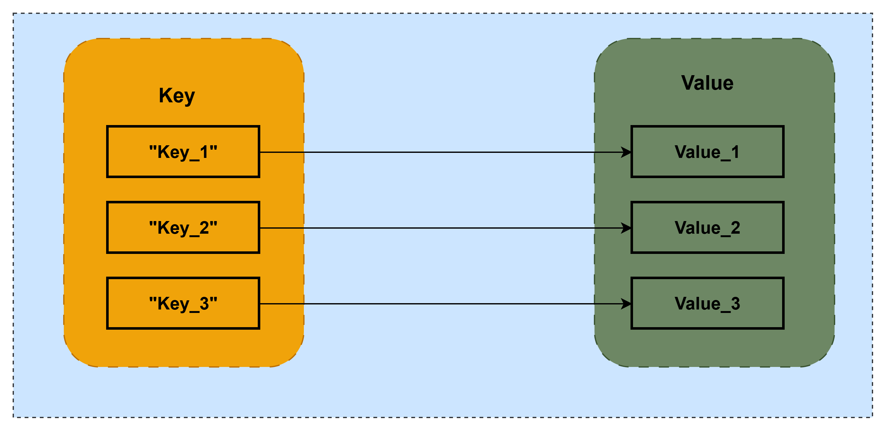

# Key-Value-Storage
---
# Abstract
Persistency is a critical feature that ensures the long-term storage and retrieval of data within S-CORE. It provides a reliable mechanism for preserving information, allowing the application to maintain its state and data integrity over time. This feature is essential for enabling the system to resume operations seamlessly, even in the event of unexpected shutdowns or system failures. By implementing robust persistence mechanisms, the application can guarantee the persistence of user-generated content, configuration settings, and other vital data, ensuring a consistent and reliable user experience.

## Why Does the Persistency Module Exist?
* **This module exists because the vehicle needs to remember things accross power cycles**.

Modern ECUs run complex software that needs to store configuration, calibration data, user settings, diagnostic logs, and state information so that when a vehicle is turned off and back on, the software can resume correctly. Without a dedicated, safe persistence layer, every module in the stack would need to invent its own file I/O, which is fragile, inconsistent, and hard to certify.

* **It provides a Key-Value Storage (KVS) abstraction**

The persistency module exposes a KVS (Key-Value Storage) interface, allowing applications to set, get, remove, and list keys, as well as manage snapshots — including snapshot counts, restoration, and reset operations. GitHub This gives all applications on the ECU a uniform, safe API for storing and retrieving data, rather than each one writing directly to the filesystem in incompatible ways.

* **It enables reliable storage of safety-relevant data**

The persistency and orchestration modules enable structured control of software processes and reliable storage of safety-relevant data. Adt In safety-critical automotive systems, data corruption during a write (e.g., due to a sudden power loss) could cause dangerous behavior on the next boot. The module handles this through snapshotting and integrity mechanisms.
## What the Persistency module does
* Provides long‑term storage and retrieval of data so that system state survives reboots and power loss.
* Focuses on safety‑critical automotive use cases: deterministic behavior, data integrity, and compatibility with standards like ISO 26262 and ISO/SAE 21434.
* Comes with Rust backends so you can use it from Rust components and have consistent logging and communication behavior across modules.
​
In practice you use it to store things like ECU configuration, calibration parameters, feature flags, or small domain data sets that must persist but don’t warrant a separate database.

---
# How the Persistance module works ?
## Start with the Problem
Imagine you're writing software for a car's ECU. Your application has some data it needs to remember — let's say the total odometer count: 124,500 km.
This number lives in RAM while the car is running. But when you turn the ignition off, RAM is wiped. Next time you start the car, your application boots fresh and has no idea what the odometer was. That's a serious problem.
The naive solution is: just write it to a file on the flash storage. And conceptually, that's exactly what the persistency module does — but it solves three hard problems that the naive approach doesn't handle.

### Problem 1: How do you find your data?
If every application just writes raw files however it wants, you end up with chaos — different formats, different locations, no consistency, hard to debug.
The KVS (Key-Value Store) solves this. Instead of managing files yourself, you just say:

    "Store the value 124500 under the name "odometer.total_km""

And to read it back:

    "Give me whatever is stored under "odometer.total_km""

That's it. The KVS is simply a named storage system — you give data a name (the key), and the module handles where and how it physically lives on disk. Under the hood, each key maps to its own small file on the filesystem, but your application never needs to know that.

### Problem 2: What if the power cuts out mid-write?
This is the nastiest problem in embedded storage. Suppose the odometer is being updated from 124,500 to 124,501 km and the car loses power at exactly that moment. You could end up with a half-written file — corrupted data that looks valid but isn't.
This is what snapshots solve. Think of a snapshot like a save point in a video game:

The KVS never overwrites your previous data directly.
Instead, it writes the new data alongside the old, and only once the write is complete and verified does it "commit" the new snapshot as the current one.
The old snapshot is kept as a fallback.

So if power is lost mid-write, on the next boot the module detects the incomplete write (using the hash file — a checksum stored next to each key's data file), discards the incomplete snapshot, and loads the last known-good one instead.
Your odometer might roll back by a few seconds of driving, but it will never be corrupt.

### Problem 3: How do you know the data hasn't been silently corrupted?
Flash storage can develop bit errors over time. To catch this, every key's data file has a corresponding hash file stored next to it. When you read a value, the module recomputes the hash of what it read and compares it to the stored hash. If they don't match, it knows the data is bad and can fall back to a previous snapshot.

## Putting It All Together: A Concrete Lifecycle

Here's what actually happens end-to-end in a real application:
1. First boot / provisioning
The ECU is flashed at the factory. A tool (`kvs_tool setkey`) writes initial values like calibration data into the KVS directory on the flash storage.
2. Application startup
The orchestrator launches your application. Your app opens the KVS, and calls `getKey("odometer.total_km")`. The module reads the file, verifies the hash, and returns `124500`. Your app is now in the same state it was before shutdown.
3. During operation
As the car drives, your app periodically calls `setKey("odometer.total_km", 124503)`. The module writes the new file + hash, and marks a new snapshot as current.
4. Clean shutdown
When the ignition is turned off gracefully, your app calls `createSnapshot()` to make sure everything is flushed and committed cleanly.
5. Unexpected power loss
On the next boot, the module detects the last snapshot was incomplete (hash mismatch), discards it, and restores the previous good snapshot. Your app gets `124501` instead of `124503` — slightly stale, but never corrupt.
